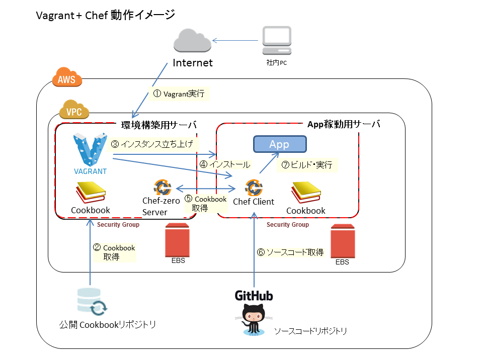

# Vagrant と Chef による自動環境の構築（VirtualBox編）

AWSといったクラウドサービスが一般に浸透したことにより、仮想環境を前提とした開発が一般的になってきました。必要になったときに必要な構成のリソースにアクセスできるクラウドの強みを活かすため、オンデマンドで仮想環境を構築し直す機会が以前よりも増えてきています。このような状況では、仮想環境をより効率的に構築することが重要になっています。本記事のシリーズズでは効率的な仮想環境構築の手段の一つとして、Vagrant と Chef というツールを使い、環境構築を自動化する方法を紹介します。

# 仮想環境構築自動化のメリット

コードで記述するメリットとして、以下のようなことが挙げられます。

- 人間が手作業で実施する場合と比べて早く構築できます。
- 構築手順がコードによって自動化できるため、何度でも同じ結果を得ることができます。作業ミスによって環境に差分が生まれるといった、システムの誤動作につながるようなトラブルを防ぐことができます。
- 個人の暗黙的なノウハウに依存していた作業がコードとして形式知化できるため、ノウハウの共有が容易になります。

# 構築する環境

本記事では、インフラ構築自動化の例として、DBを使った簡単なWebアプリケーションを構築します。

- 仮想マシン: VirtualBox
- OS: CentOS
- DB: PostgreSQL
- アプリケーションサーバ: Netty (Play Framework に付属）
- プログラミング言語: Java 8

今回は手元で確認できる仮想マシンとして VitualBox を利用します。次回公開する記事では、クラウドホスティングサービスとして最も人気のある Amazon EC2 での環境構築手順も紹介します。

# 環境構築に使用するツール

本記事では環境構築に以下の2つのツールを使います。元々は別のツールですが、両者を連携させることで、仮想環境の構築で必要となる一連の作業（仮想マシンの立ち上げ、OSや各種ソフトウェアのインストール、アプリケーションのビルドなど）を自動化できます。

<dl>
  <dt>Vagrant</dt>
  <dd>仮想マシンのフロントエンドとなるツール。指定した設定の仮想マシンを立ち上げることができる。また、有志によるプラグインを利用することで、立ち上げた仮想マシンに対して Chef をインストール・実行できる。</dd>
  <dt>Chef</dt>
  <dd>ソフトウェアのインストールや各種設定を行うことができる。本記事では、ゲストOSの環境設定に利用する。</dd>
</dl>

# Vagrant - Chef の連携による仮想環境構築の流れ

※説明と画像に食い違いがあリます。後で最新に置き換えます。

Vagrant と Chef の詳細に入る前に、両者を連携させて仮想環境を構築する手順を紹介します。



# まずは Vagrant と Chef を動かしてみよう

## Vagrant のインストール

最初に Vagrant で CentOS がインストールされた VM を立ち上ます。以下のURLからバージョン1.6.5のVagrantのインストーラをダウンロードし、インストールを行って下さい。

http://www.vagrantup.com/downloads

（注意）本記事執筆時点での最新バージョンは 1.7.2 ですが、本記事では動作確認ができたバージョンをここでは使います。

インストールしたら以下のコマンドで Vagarant が実行できることを確認してください。

```
% vagrant --version
Vagrant 1.6.5
```

## VirtualBoxのインストール

今回はVirtualBoxで仮想マシンを立ち上げます。VirtualBoxが手元にインストールされていない場合はインストールしてください。

http://www.oracle.com/technetwork/server-storage/virtualbox/overview/index.html

## Chefのインストール

Chefの開発に必要なひと通りの開発環境がパッケージされたChef-DKi(バージョン0.3.5)をダウンロードして、インストールしてください。以下のURLからインストーラをダウンロードできます。画面中央にあるOSのアイコンをクリックし、OSにあったインストーラのダウンロードページを開く必要があります。

https://downloads.chef.io/chef-dk/

（注意）
- 本記事執筆時点での最新バージョンは0.3.5ですが、動作確認がとれたバージョンを使用しています。
- ホスト側ではChefは実行されませんが、ゲストOSにChefで環境設定するために必要なツール群がChef-DKでインストールされます。
- ChefはChef-DKと一緒にインストールされるRubyで実行されことが推奨されています。PATH上に別のRubyがあるとトラブルが発生するため、以下のコマンドでChef-DKのRubyを使うように指定して下さい。

 eval "$(chef shell-init SHELL_NAME)"
（注意）

SHELL_NAMEの箇所は自分が使っているシェル名に置き換えてください。

以下のコマンドでChef-DKがインストールされていることを確認してください。

%chef -v
Chef Development Kit Version: 0.3.5


## Vagrantプラグインのインストール

VagarntからVirtualBoxを利用する場合、vagrant-vbguestというVagrantのプラグインをインストールしておく必要があります。

$vagrant plugin install vagrant-vbguest

## 仮想マシンの起動確認

それでは以下のコマンドで仮想マシンを立ち上げてみましょう。最初はBoxのダウンロードとインストールなどが実行されるため、時間がかかる点に注意してください。

$ vagrant up

==> default: Machine booted and ready!
==> default: Checking for guest additions in VM...
==> default: Mounting shared folders...
    default: /vagrant => /Users/yohei/work/vagrant-chef-sample
うまく起動できたら、SSHでゲストOSに接続できることも確認します。

$ vagrant ssh


# Vagrant と Chef の実践

ここからは前の節で環境構築し、動作を確認したアプリケーションについて実際に Vagrant と Chef の設定ファイルを書いて、環境構築する手順を紹介します。

# Vagrantfile の作成

Vagarnt を実行する際には Vagrantfile という設定ファイルで Vagrant の実行方法を指定します。Vagrantfile のひな形は以下のコマンドで作成できます。

```
$ vagrant init
```

Vagrant は 0 から仮想マシンを起動しません。そのかわりに仮想マシンのベースイメージを使用することで、起動時間を早くします。このベースイメージのことを Box といいます。Box は自分で作成する必要はありません。Vagrantbox.es という Web サイトで有志が作成した Box が提供されています。

http://www.vagrantbox.es/

ここでは Vagrantbox.es に掲載されている CentOS 7 の Box のうち、「CentOS7.0 x86_64 minimal (VirtualBoxGuestAddtions 4.3.14)」を利用します。

```
$vim Vagrantfile

 Vagrant.configure(2) do |config|
   config.vm.box = "centos7"
   config.vm.box_url="https://f0fff3908f081cb6461b407be80daf97f07ac418.googledrive.com/host/0BwtuV7VyVTSkUG1PM3pCeDJ4dVE/centos7.box"
 end
```

- config.vm.box に自分の box の名前として box の内容が分かるような文字列を指定します。
- config.vm.box_url には CentOS 7 の Box の URL を指定します。

これらの記述により、ローカルの Box 置き場に "centos7" という Box が存在する場合、ローカルの Box を使います。存在しない場合、指定した URL から Box をダウンロードし、ローカルに配置します。

#仮想マシンの起動

この時点で仮想マシンが起動できるか確かめてみましょう。なお、今回はVirtualBoxで仮想マシンを立ち上げます。VirtualBoxが手元にインストールされていない場合はインストールしてください。

http://www.oracle.com/technetwork/server-storage/virtualbox/overview/index.html

また、VagarntからVirtualBoxを利用する場合、vagrant-vbguestというVagrantのプラグインをインストールしておく必要があります。

```
$vagrant plugin install vagrant-vbguest
```

それでは以下のコマンドで仮想マシンを立ち上げてみましょう。最初はBoxのダウンロードとインストールなどが実行されるため、時間がかかる点に注意してください。

```
$ vagrant up

==> default: Machine booted and ready!
==> default: Checking for guest additions in VM...
==> default: Mounting shared folders...
    default: /vagrant => /Users/yohei/work/vagrant-chef-sample
```

うまく起動できたら、SSHでゲストOSに接続できることも確認します。

```
$ vagrant ssh

```

その他にもよく使うコマンドとして以下があります。

- Vagarntの実行状況を確認する。

```
%vagrant status
```

- 仮想マシンを停止する。

```
% vagrant halt
```

- 仮想マシンを一時停止する。

```
% vagrant suspend
```

- 仮想マシンを再開する。

```
% vagrant resume
```

- 仮想マシンを終了する。※仮想マシンを作り直したい時に使用する。

```
% vagrant destroy
```

# Chefのインストール
仮想マシンの起動まで確認できたため、次にChefを使ってPlay frameworkとPostgreSQLのインストールを行います。

まずChefの開発に必要なひと通りの開発環境がパッケージされたChef-DKi(バージョン0.3.5)をダウンロードして、インストールしてください。以下のURLからインストーラをダウンロードできます。画面中央にあるOSのアイコンをクリックし、OSにあったインストーラのダウンロードページを開く必要があります。

https://downloads.chef.io/chef-dk/

（注意）
- 本記事執筆時点での最新バージョンは0.3.5ですが、動作確認がとれたバージョンを使用しています。
- ホスト側ではChefは実行されませんが、ゲストOSにChefで環境設定するために必要なツール群がChef-DKでインストールされます。

なお、ChefはChef-DKと一緒にインストールされるRubyで実行されことが推奨されています。PATH上に別のRubyがあるとトラブルが発生するため、以下のコマンドでChef-DKのRubyを使うように指定して下さい。

```
 eval "$(chef shell-init SHELL_NAME)"
```

（注意）
- SHELL_NAMEの箇所は自分が使っているシェル名に置き換えてください。

以下のコマンドでChef-DKがインストールされていることを確認してください。

```
%chef -v
Chef Development Kit Version: 0.3.5
```

# Chefの実行に必要なVagrantプラグインのインストール

VagrantとChefを使ってゲストOSの設定を行う場合、以下のような流れでゲストOSの設定が行われます。これらはVagrantによって自動的に実行されるため、ユーザは特に意識する必要がありません。

1. ホスト側でChef-zero serverという簡易的なサーバを立ち上げ、クックブックをサーバにアップロードする
2. ゲスト側にChef-clientがインストールされる
3. ゲスト側のChef-clientがホスト側のChef-zero serverからクックブックを受け取り、クックブックにそって各種設定を行う。

ここでは最初に上記の1と2が実行されることを確認しましょう。まず、ホスト側でChef-zero serverを立ち上げるために必要なVagrantプラグイン vagrant-chef-zero をインストールします。

```
% vagrant plugin install vagrant-chef-zero
```

次にゲストOSにChefをインストールするために必要なVagrantプラグイン vagrant-omnibus をインストールします。

```
% vagrant plugin install vagrant-omnibus
```

両プラグインを利用する設定を Vagrantfile に追記します。以下の設定ファイルでは以下を指示しています。
- ゲストOSに最新のChefをインストールする
- Chef-zero のリポジトリとしてカレントディレクトリを設定する。
- プロビジョン（各種設定を行うツール）としてChef-clientを設定する。この時点では実行するクックブックは空のまま。

```
Vagrant.configure(2) do |config|
  config.omnibus.chef_version=:latest
  config.chef_zero.chef_repo_path = "."
  config.vm.box = "centos7"
  config.vm.box_url = "https://f0fff3908f081cb6461b407be80daf97f07ac418.googledrive.com/host/0BwtuV7VyVTSkUG1PM3pCeDJ4dVE/centos7.box"
  config.vm.provision :chef_client do |chef|
    chef.custom_config_path = "chef_custom_config"
    chef.run_list = []
  end
end
```

ここで Chef-Clientの設定ファイルとして"chef_custom_config"を指定しています。カレントディレクトリに以下のようなファイルを作成します。これはSSH関係の警告を出さないようにするための対処です。

```
% more chef_custom_config
Chef::Config.ssl_verify_mode = :verify_peer
```

それでは仮想マシンが立ち上がるところからプロセスを確認するため、一度、作成済みの仮想マシンを破棄し、再度立ち上げます。

```
% vagrant destroy
% vagrant up
```

プラグインのインストールと設定ファイルの記述が正しく行われていれば、Chef Zero Serverも起動し、ゲストにChefのインストールが行われます。今回はクックブックを指定なかったため、Chefのrun listが空である旨が記載されています。

```
% vagrant up
Starting Chef Zero at http://192.168.179.4:4000
==> default: Installing Chef 12.0.3
==> default: Thank you for installing Chef!
==> default: Running provisioner: chef_client...
==> default: Warning: Chef run list is empty. This may not be what you want.
==> default: [2015-01-24T20:08:40-05:00] INFO: Chef Run complete in 0.046189483 seconds
```

# Cookbookを使った PostgreSQL のインストール

ここからようやく本題であるCookbookの作成にとりかかります。今回は以下の作業を自動化します。

- PostgreSQLの server、client、contrib パッケージのインストール
- postgres ユーザのパスワード設定
- sampledb データベースの作成

## コミュニティの Cookbook の利用

Cookbookは全て自分自分で作成する必要はなく、すでにコミュニティの有志によって作成されたものを再利用することができます。Cookbookの共有サイトである以下のURLにアクセスし、PostgreSQL をインストールできるCookbookを探してみましょう。

https://supermarket.chef.io/

postgres というCookbookがよく使われているようです。数十万件ダウンロードされ、最近もメンテナンスされているようですので、こちらを利用しましょう。

https://supermarket.chef.io/cookbooks/postgresql

## Berkshelf による Cookbook の依存関係解決

Cookbook を利用する場合、注意する必要があるのが、Cookbook 間の依存関係です。これはライブラリと同じで、ある Cookbook が別の Cookbook に依存しているために目的の Cookbook を利用するために芋づる式に依存先の Cookbook を集めてくる必要があるのです。

この依存関係の問題を解決するのが Berkshelf です。Berkshelf の設定ファイルである Berksfile に必要な Cookbook を記載しておけば、Berkshelf が必要な Cookbook を自動的に集めてきてくれます。

カレントディレクトリに Berksfile というファイルを作成し、以下のように記述してください。

```
% more Berksfile
source "https://api.berkshelf.com"

cookbook 'postgresql'
```

Berkshelf は Chef-DK に入っているため、すでに利用可能です。以下のコマンドを実行し、postgresql と依存先の Cookbook をダウンロードしてください。
- 第1引数 vendor は Cookbook をダウンロードすることを意味します。
- 第2引数の coobooks は Cookbook のダウンロード先ディレクトリです。vagrant-chef-zero プラグインは Cookbooks というディレクトリに置かれた Cookbook を Chef Zero Server にアップロードします。

```
% berks vendor cookbooks
```

次に Vagrantfile を開いて、実行対象の Cookbook として postgresql を指定してください。vagrant provision を実行すると、実際に postgresql が Chef Zero Server にアップロードされた後、ゲスト側の Chef がその Cookbook を実行します。

以下では postgresql のクックブックのうち、server と client と contrib の3つのレシピを指定しています。さらに postgresql の属性として postgres ユーザのパスワードを指定しています。このように Cookbook で用意されている設定に対して、ユーザが期待する設定を上書きすることもできます。

```
% vim Vagrantfile
    config.vm.provision :chef_client do |chef|
      chef.custom_config_path = "chef_custom_config"
      chef.run_list = [
          "postgresql::server",
          "postgresql::client",
          "postgresql::contrib"
      ]
      chef.json = {
        :postgresql => {
          :password => 'postgres'
        }
      }
    end
```

実際に PostgreSQL がインストールされているか確認しましょう。無事に 9.2.7 がインストールされ、postgres ユーザでログインできることが確認できました。

```
% vagrant provision
% vagrant ssh
[vagrant@localhost ~]$ psql -h localhost -U postgres -W
psql (9.2.7)
postgres=#
```

##データベース構築 Cookbook の作成

次に PostgreSQL データベース sampledb を作成します。ここでもコミュニティのクックブック dabatase を利用して、DBの設定を行います。

https://supermarket.chef.io/cookbooks/database

ただし、 database はDBの設定を行うためのライブラリに相当する Cookbook で、実際の設定作業は自分のレシピとして実装する必要があります。Chef の慣習ではコミュニティの Cookbook と自作の Cookbook を分けて配置することが一般的です。

それでカレントディレクトリ配下に site-cookbooks というディレクトリを作成し、PostgreSQL の設定を行う Cookbook として postgresql_config を作成します。
- metadata.rb が Cookbook の情報を記載する箇所です。Cookbookの依存関係なども記載できます。
- recipes ディレクトリはレシピの配置場所です。default.rb はデフォルトで実行されるレシピです。database に定義されている postgresql_database タスクを利用して実装しています。ここでは localhost に sample_db というデータベースを作成し、 postgres ユーザからアクセスできるようにしています。

```
% more site-cookbooks/postgresql_config/metadata.rb
name             'postgresql_config'
maintainer       'Yohei Onishi'
maintainer_email 'yohei@example.co.jp'
license          'Yohei Onishi All rights reserved'
description      'Configures postgres'
long_description 'Configures postgres'
version          '0.1.0'

%more site-cookbooks/postgresql_config/recipes/default.rb
postgresql_database 'sampledb' do
  connection(
    :host     => '127.0.0.1',
    :port     => 5432,
    :username => 'postgres',
    :password => node['postgresql']['password']['postgres']
  )
  template 'DEFAULT'
  encoding 'DEFAULT'
  tablespace 'DEFAULT'
  connection_limit '-1'
  owner 'postgres'
  action :create
end
```

すでに説明した通り、Chef Zero Server で Cookbooks を利用するために、berks コマンドで依存先の Cookbooks を含めて再度ダウンロードします。以下のように dabatase および postgresql_config を追記してください。postgresql_config は自作の Cookbook であるため、取得元を指定していることに注意してください。このように Berksfile を記載することで、自作の Cookbook だけ site-cookbooks に配置して、構成管理対象にし、プロビジョニングするときだけコミュニティの Cookbook を含めて cookbooks にコピーして利用することができます。 

```
% more Berksfile                                                                                       (git)-[mast
source "https://api.berkshelf.com"

#original cookbooks
cookbook 'postgresql_config',  path: './site-cookbooks/postgresql_config'

#community cookbooks
cookbook 'database'
cookbook 'postgresql'
```

新たに利用する Cookbook をダウンロードします。

```
% berks vendor cookbooks
```

新たに追加した Cookbook を実行するため、Vagarntfile の Chef Client 設定部分の run_list に database と postgresql_config を追加してください。

```
  config.vm.provision :chef_client do |chef|
    chef.custom_config_path = "chef_custom_config"
    chef.run_list = [
        "postgresql::server",
        "postgresql::client",
        "postgresql::contrib",
        "database::postgresql",
        "postgresql_config"
    ]
    chef.json = {
      :postgresql => {
        :password => 'postgres'
      }
    }
  end
```

再度プロビジョンを行った後、SSH接続して、PostgreSQL 上に sampledb データベースが作成されていることを確認してください。

```
% vagrant provision
% vagrant ssh
[vagrant@localhost ~]$ psql -h localhost -U postgres -W
postgres=# \connect sampledb
データベース "sampledb" にユーザ"postgres"として接続しました。
```

以上で、ゲスト側に PostgreSQL をインストールし、sampledb を作成することができました。

